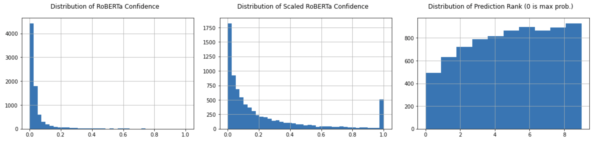
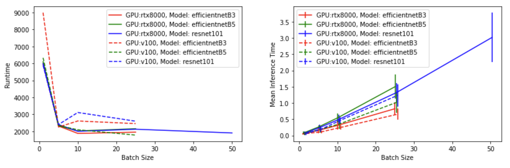
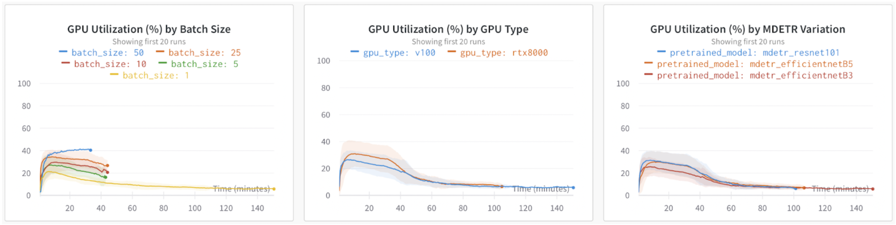
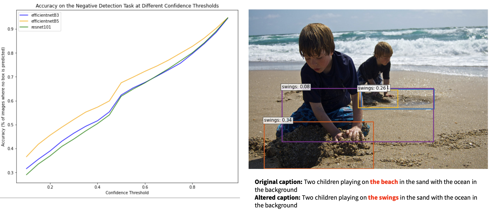
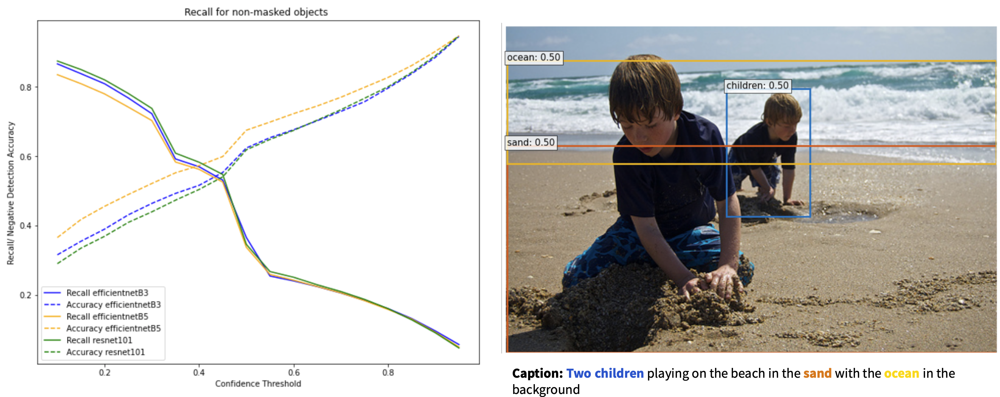

# Evaluating the Robustness of Text-Conditioned OD Models to False Captions

## Summary

This repository is the official implementation of **Evaluating the Robustness of Text-Conditioned Object Detection Models to False Captions**. 

* **Problem Statement**: Empirically, text-conditioned OD models have shown weakness to negative captions (a caption where the implied object is not in the image); currently the means to evaluate this phenomenon systematically are limited.

* **Approach**: Use large pretrained MLM (e.g., RoBERTa) to create negative captions dataset. Perform systematic evaluation over SOTA MDETR models. Evaluate model robustness + runtime performance of different model variations

* **Benefit**: This work shows the strengths and limitations of current text-conditioned OD methods

<p align="center">
  
</p>

## Contents

- `data/`: Flickr30k annotation data and output of negative-caption generation
- `sbatch/`: Slurm scripts used to run MDETR evaluation
- `eval_flickr.*`: Using MDETR models for inference on our negative-caption dataset
- `eval_MLM.ipynb`: Analysis of the MLM (`roberta-large`) outputs
- `eval_runtime.ipynb`: Analysis of the MDETR inference runtime
- `pre_MLM.ipynb`: Generation and preprocessing of negative-caption dataset using `roberta-large`

## Setup

### Python Dependencies

You'll need to have Anaconda/Miniconda installed on your machine. You can duplicate our environment via the following command:

```setup
conda env create -f environment.yaml
```

This project relies on code from the official **MDETR** repo, so you'll need to clone it to your machine:

```setup
git clone https://github.com/ashkamath/mdetr.git
```

### Flickr30k Dataset

Download the **flickr30k** dataset: [link](https://shannon.cs.illinois.edu/DenotationGraph/)

### Script Paths

Finally, update the paths in `eval_flickr.sh` to match your environment:

- `OUTPUT_DIR`: Folder for evaluation results to be saved to
- `IMG_DIR`: **flickr30k** image folder
- `MDETR_GIT_DIR`: Path to **MDETR** repo cloned from above

## Evaluation

The core model evaluation is run via `eval_flickr.sh`:

```
./eval_flickr.sh <batch size> <pretrained model> <gpu type>
```

The currently supported pretrained models are:
- `mdetr_efficientnetB5`
- `mdetr_efficientnetB3`
- `mdetr_resnet101`

For example to evaluate `mdetr_resnet101` with a batch size of 8 while using an RTX8000:

```eval
./eval_flickr.sh 8 mdetr_resnet101 rtx8000
```

All of the MDETR evaluation was run via Slurm jobs: refer to `sbatch/` for the exact scripts used.

## Results

### MLM Results



In general, RoBERTa predictions are of low confidence, but more predictions accepted from lower k. Higher confidence predictions more likely to be synonyms, and so therefore are not accepted. 


### MDETR System Evaluation



We saw a significant improvement in total runtime from batch size ≠ 1, however, minimal improvement in runtime as batch size increased further. We also saw a ~linear increase in inference time as batch size increased. Comparing the V100 to the RTX8000, both GPUs comparable in system speed performance (slight difference in mean inference time but standard deviation overlap is too great to make any strong claims)



During MDETR inference we recorded GPU utilisation statistics; the diagram above shows this data stratified by batch size, GPU type, and MDETR variation. As expected, using a higher batch size results in better GPU utilization. Comparing GPUs, we see that RTX8000 achieves better utilisation overall. Looking at MDETR variations, EfficientNetB3 has worst utilisation, while EfficientNetB5 and ResNet101 are comparable.

### MDETR Model Performance



The model performed xyz



Looking at recall, the model did xyz